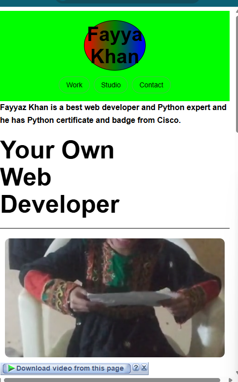

# Project1 – Responsive Web Page 🌐

A clean and fully responsive web page built using **HTML, CSS, and JavaScript**.  
Designed to work smoothly on **desktop, tablet, and mobile devices**.

---

## 🚀 Features

- Fully responsive layout
- Clean and modern user interface
- Cross-browser compatibility
- Well-structured and readable code

---

## 🛠️ Technologies Used

- HTML5
- CSS3
- JavaScript

---

## 📂 Project Use

- Personal website
- Landing page
- Business or portfolio website

---

## 📸 Preview

### 💻 Desktop View

### 📱 Tablet View

### 📲 Mobile View

---

## 📝 Project Notes

This project is a **modern and fully responsive website** built using **HTML, CSS, and JavaScript**.
The main focus of this project is to provide a smooth and engaging **user experience using animations and interactive effects**.

### 🔹 Navigation Bar (Navbar)

The navigation bar includes sections such as **Home, Work, Studio, and Contact**.
Each navigation item uses **smooth hover and transition animations**, allowing users to move between sections in a visually pleasing way.
These animations enhance usability and give the website a professional look.

### 🔹 Section Animations

As the user scrolls down the page, different sections appear with **fade-in and slide animations**.
This creates a dynamic feel and keeps the user engaged while browsing the website.

### 🔹 Projects Section

The **Projects section** contains **six project cards** displayed at the bottom of the page.
Each project card includes **hover animations** that:

- Highlight the project when hovered

- Add smooth motion effects
- Improve interactivity and visual appeal

These animations help users easily focus on individual projects.

### 🔹 Responsive Design

The website is fully responsive and works smoothly on:

- 💻 Desktop devices

- 📱 Tablets
- 📲 Mobile phones

This project is ideal for **beginners and intermediate developers** who want to learn how to build
a clean, fast, and animated responsive website.
