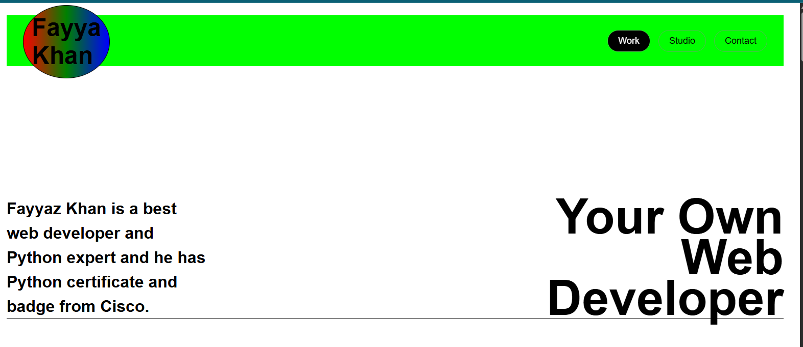
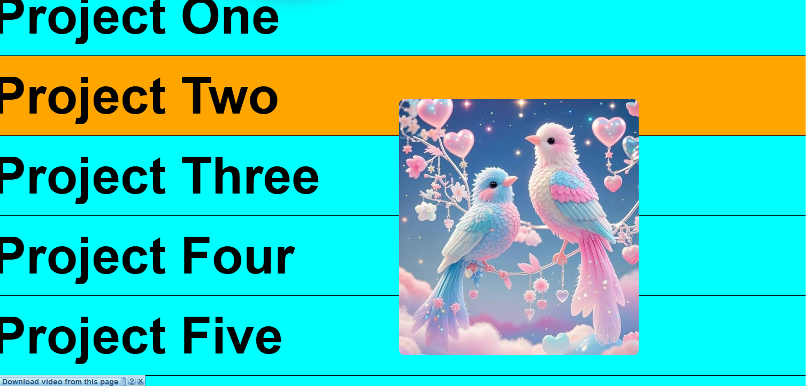

# Project1 - Responsive Web Page 🌐

A clean and fully responsive web page built using **HTML, CSS, and JavaScript**.  
Designed to work smoothly on **desktop, tablet, and mobile devices**.

---

## 🚀 Features

- Fully responsive layout
- Clean and modern user interface
- Cross-browser compatible
- Well-structured and readable code

---

## 🛠️ Technologies Used

- HTML5
- CSS3
- JavaScript

---

## 📂 Project Use

- Personal website
- Landing page
- Business or portfolio website

---

## 📸 Preview

### 💻 Desktop View

### 📱 Tablet View

### 📲 Mobile View

---

## 📌 Notes

This project is ideal for clients looking for a **simple, fast, and responsive webpage**.  
Screenshots show how the page looks on different devices.  
